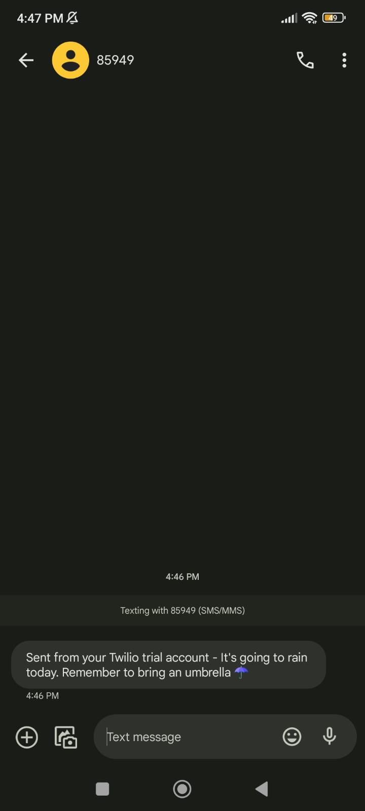

# Day 35 - Keys, Authentication & Environment Variables: Send SMS

## Concepts Practiced

- API keys to authenticate and get the weather from OpenWeatherMap
- Sending alerts via the SMS with Twilio
- Environment variables and hiding API keys
